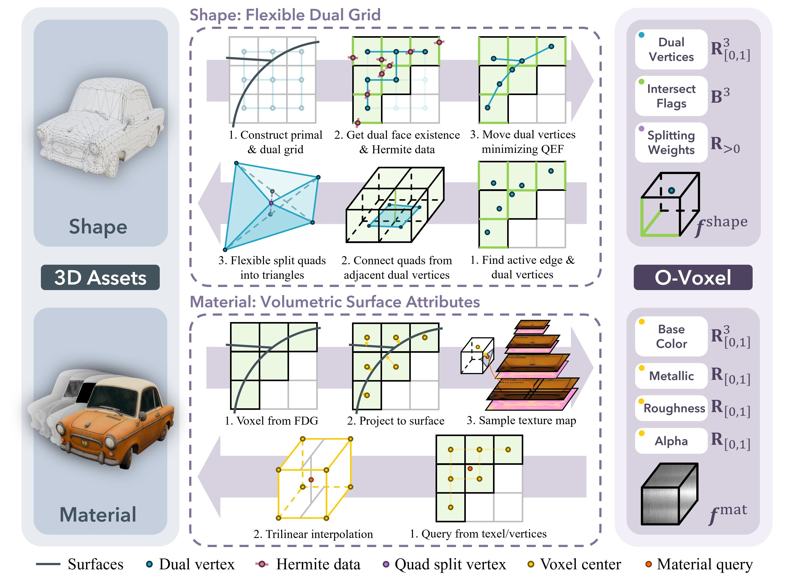

# O-Voxel: A Native 3D Representation

**O-Voxel** is a sparse, voxel-based native 3D representation designed for high-quality 3D generation and reconstruction. Unlike traditional methods that rely on fields (e.g., Occupancy fields, SDFs), O-Voxel utilizes a **Flexible Dual Grid** formulation to robustly represent surfaces with arbitrary topology (including non-manifold and open surfaces) and **volumetric surface properties** such as Physically-Based Rendering (PBR) material attributes.

This library provides an efficient implementation for the instant bidirectional conversion between Meshes and O-Voxels, along with tools for sparse voxel compression, serialization, and rendering.



## Key Features

- **🧱 Flexible Dual Grid**: A geometry representation that solves a enhanced QEF (Quadratic Error Function) to accurately capture sharp features and open boundaries without requiring watertight meshes.
- **🎨 Volumetric PBR Attributes**: Native support for physically-based rendering properties (Base Color, Metallic, Roughness, Opacity) aligned with the sparse voxel grid.
- **⚡ Instant Bidirectional Conversion**: Rapid `Mesh <-> O-Voxel` conversion without expensive SDF evaluation, flood-filling, or iterative optimization.
- **💾 Efficient Compression**: Supports custom `.vxz` format for compact storage of sparse voxel structures using Z-order/Hilbert curve encoding.
- **🛠️ Production Ready**: Tools to export converted assets directly to `.glb` with UV unwrapping and texture baking.

## Installation

```bash
git clone -b main https://github.com/microsoft/TRELLIS.2.git --recursive
pip install TRELLIS.2/o_voxel --no-build-isolation
```

## Quick Start

> See also the [examples](examples) directory for more detailed usage.

### 1. Convert Mesh to O-Voxel [[link]](examples/mesh2ovox.py)
Convert a standard 3D mesh (with textures) into the O-Voxel representation.

```python
asset = trimesh.load("path/to/mesh.glb")

# 1. Geometry Voxelization (Flexible Dual Grid)
# Returns: occupied indices, dual vertices (QEF solution), and edge intersected
mesh = asset.to_mesh()
vertices = torch.from_numpy(mesh.vertices).float()
faces = torch.from_numpy(mesh.faces).long()
voxel_indices, dual_vertices, intersected = o_voxel.convert.mesh_to_flexible_dual_grid(
    vertices, faces,
    grid_size=RES,                              # Resolution
    aabb=[[-0.5,-0.5,-0.5],[0.5,0.5,0.5]],      # Axis-aligned bounding box
    face_weight=1.0,                            # Face term weight in QEF
    boundary_weight=0.2,                        # Boundary term weight in QEF
    regularization_weight=1e-2,                 # Regularization term weight in QEF
    timing=True
)
## sort to ensure align between geometry and material voxelization
vid = o_voxel.serialize.encode_seq(voxel_indices)
mapping = torch.argsort(vid)
voxel_indices = voxel_indices[mapping]
dual_vertices = dual_vertices[mapping]
intersected = intersected[mapping]

# 2. Material Voxelization (Volumetric Attributes)
# Returns: dict containing 'base_color', 'metallic', 'roughness', etc.
voxel_indices_mat, attributes = o_voxel.convert.textured_mesh_to_volumetric_attr(
    asset,
    grid_size=RES,
    aabb=[[-0.5,-0.5,-0.5],[0.5,0.5,0.5]],
    timing=True
)
## sort to ensure align between geometry and material voxelization
vid_mat = o_voxel.serialize.encode_seq(voxel_indices_mat)
mapping_mat = torch.argsort(vid_mat)
attributes = {k: v[mapping_mat] for k, v in attributes.items()}

# Save to compressed .vxz format
## packing
dual_vertices = dual_vertices * RES - voxel_indices
dual_vertices = (torch.clamp(dual_vertices, 0, 1) * 255).type(torch.uint8)
intersected = (intersected[:, 0:1] + 2 * intersected[:, 1:2] + 4 * intersected[:, 2:3]).type(torch.uint8)
attributes['dual_vertices'] = dual_vertices
attributes['intersected'] = intersected
o_voxel.io.write("ovoxel_helmet.vxz", voxel_indices, attributes)
```

### 2. Recover Mesh from O-Voxel [[link]](examples/ovox2mesh.py)
Reconstruct the surface mesh from the sparse voxel data.

```python
# Load data
coords, data = o_voxel.io.read("path/to/ovoxel.vxz")
dual_vertices = data['dual_vertices']
intersected = data['intersected']
base_color = data['base_color']
## ... other attributes omitted for brevity

# Depack
dual_vertices = dual_vertices / 255
intersected = torch.cat([
    intersected % 2,
    intersected // 2 % 2,
    intersected // 4 % 2,
], dim=-1).bool()

# Extract Mesh
# O-Voxel connects dual vertices to form quads, optionally splitting them 
# based on geometric features.
rec_verts, rec_faces = o_voxel.convert.flexible_dual_grid_to_mesh(
    coords.cuda(), 
    dual_vertices.cuda(), 
    intersected.cuda(), 
    split_weight=None, # Auto-split based on min angle if None
    grid_size=RES,
    aabb=[[-0.5,-0.5,-0.5],[0.5,0.5,0.5]],
)
```

### 3. Export to GLB [[link]](examples/ovox2glb.py)
For visualization in standard 3D viewers, you can clean, UV-unwrap, and bake the volumetric attributes into textures.

```python
# Assuming you have the reconstructed verts/faces and volume attributes
mesh = o_voxel.postprocess.to_glb(
    vertices=rec_verts,
    faces=rec_faces,
    attr_volume=attr_tensor, # Concatenated attributes
    coords=coords,
    attr_layout={'base_color': slice(0,3), 'metallic': slice(3,4), ...}, 
    grid_size=RES,
    aabb=[[-0.5,-0.5,-0.5],[0.5,0.5,0.5]],
    decimation_target=100000,
    texture_size=2048,
    verbose=True,
)
mesh.export("rec_helmet.glb")
```

### 4. Voxel Rendering [[link]](examples/render_ovox.py)
Render the voxel representation directly.

```python
# Load data
coords, data = o_voxel.io.read("ovoxel_helmet.vxz")
position = (coords / RES - 0.5).cuda()
base_color = (data['base_color'] / 255).cuda()

# Render
renderer = o_voxel.rasterize.VoxelRenderer(
    rendering_options={"resolution": 512, "ssaa": 2}
)
output = renderer.render(
    position=position,          # Voxel centers
    attrs=base_color,           # Color/Opacity etc.
    voxel_size=1.0/RES,
    extrinsics=extr,
    intrinsics=intr
)
# output.attr contains the rendered image (C, H, W)
```

## API Overview

### `o_voxel.convert`
Core algorithms for the conversion between meshes and O-Voxels.
*   `mesh_to_flexible_dual_grid`: Determines the active sparse voxels and solves the QEF to determine dual vertex positions within voxels based on mesh-voxel grid intersections.
*   `flexible_dual_grid_to_mesh`: Reconnects dual vertices to form a surface.
*   `textured_mesh_to_volumetric_attr`: Samples texture maps into voxel space.

### `o_voxel.io`
Handles sparse voxel file I/O operations.
*   **Formats**: `.npz` (NumPy), `.ply` (Point Cloud), `.vxz` (Custom compressed, recommended).
*   **Functions**: `read()`, `write()`.

### `o_voxel.serialize`
Utilities for spatial hashing and ordering.
*   `encode_seq` / `decode_seq`: Converts 3D coordinates to/from Morton codes (Z-order) or Hilbert curves for efficient storage and processing.

### `o_voxel.rasterize`
*   `VoxelRenderer`: A lightweight renderer for sparse voxel visualization during training.

### `o_voxel.postprocess`
*   `to_glb`: A comprehensive pipeline for mesh cleaning, remeshing, UV unwrapping, and texture baking.
